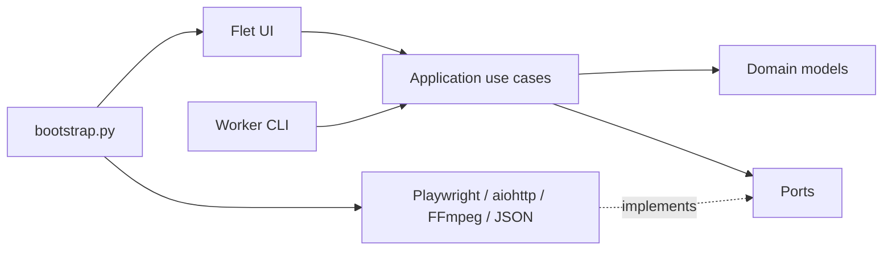

# Architecture

GetCourse Video Downloader — модульный монолит с направленными зависимостями.
Архитектура отделяет бизнес-сценарии от Flet, Playwright, сети и файловой системы,
но не усложняет desktop-приложение микросервисами.



## Слои

### Domain

`src/getcourse_downloader/domain`

Содержит неизменяемые модели `Course`, `Lesson`, `DownloadRequest`, `MediaKind`,
`MediaSelection`, события worker’а и ошибки. Здесь запрещены импорты Flet,
Playwright, aiohttp, subprocess и storage.

`MediaKind` пока содержит `video` и `audio`. `MediaSelection` не бывает пустым;
его сериализованный порядок стабилен: сначала видео, затем аудио.

### Application

`src/getcourse_downloader/application`

Содержит use cases и `Protocol`-порты. Application знает, что нужно выполнить, но
не знает, как открыть Firefox, прочитать JSON или запустить дочерний процесс.

### Infrastructure

`src/getcourse_downloader/infrastructure`

Реализует порты:

- GetCourse discovery и перехват Rutube master playlist через Playwright;
- видео-пайплайн: HLS-загрузка и FFmpeg muxing;
- аудио-пайплайн: пассивное извлечение прямых HTML audio-источников и потоковая
  загрузка через aiohttp;
- атомарные JSON repositories;
- platform-specific paths;
- subprocess worker client.

### Presentation

`src/getcourse_downloader/presentation`

Flet screens разделены на `view`, `controller`, `state` и `components`. CLI содержит
worker, discovery и live-browser entrypoints. Presentation отображает domain events,
но не разбирает текстовые логи для принятия решений.

### Composition root

`bootstrap.py` — единственное место, где конкретные adapters соединяются с use cases.
Точки входа не создают зависимости внутри экранов.

## Основные потоки

### Получение курсов

1. Пользователь вставляет URL на чистом `StartScreen`.
2. `StartScreen` вызывает `StartController`.
3. `DiscoverCourses` проверяет URL.
4. `GetCourseDiscoverer` выполняет авторизацию и парсинг.
5. `JsonCourseRepository` атомарно сохраняет совместимый `courses.json`.

### Загрузка

1. `CoursesScreen` создаёт типизированный `DownloadRequest`.
2. `SubprocessDownloadGateway` запускает тот же EXE с `--download-worker`.
3. Worker собирает in-process adapters через собственный composition root.
4. События передаются в UI как JSON Lines.
5. MP4 сначала создаётся как `.part`, затем атомарно перемещается на итоговый путь.

Канал stdin worker’а используется только для команд интерфейса. FFmpeg/FFprobe
для локальных файлов запускаются с закрытым stdin; при потоковой передаче
фрагментов FFmpeg получает отдельный media-pipe. После события `SUMMARY` родитель
закрывает канал команд, чтобы listener получил EOF и worker штатно завершился.

### Выбор материалов

После загрузки дерева, в верхней панели `CoursesScreen` рядом с индикатором
скорости, пользователь выбирает «Видео», «Аудио» или «Видео и аудио». Активный
переключатель имеет зелёную обводку. По умолчанию выбран режим «Видео и аудио».
Выбор проходит по цепочке:

```text
CoursesScreen.media_selection
  -> CoursesController
  -> DownloadRequest.media_selection
  -> request JSON дочернего worker
  -> PlaywrightDownloadGateway
```

Выбор не влияет на discovery дерева курса: приложение не открывает все уроки при
вводе URL. Отсутствующее поле `media_selection` в старом request JSON означает
`video`; схема `DownloadRequest` остаётся версии 2.

### Два независимых media-пайплайна

`PlaywrightDownloadGateway` владеет авторизованным browser context и обходом
выбранных уроков. Он делегирует обработку типам материалов, а не смешивает их в
одном downloader:

- **Видео.** Сетевой observer и допустимые embed-frame читают уже появившиеся HLS
  manifest. `HlsDownloader` получает сегменты и передаёт их `FfmpegMuxer`.
  Существующие headers, quality selection и FFmpeg behaviour остаются в этой ветке.
- **Аудио.** `infrastructure.media.audio.extract_audio_sources` читает только
  `<audio src>` и вложенные `<audio><source src>` из уже загруженного HTML.
  `DirectAudioDownloader` делает обычный HTTP GET с разрешёнными redirect,
  записывает поток в `.<name>.gcd-part` и после успеха атомарно переименовывает
  файл. Валидный partial-файл докачивается с `Range`; при полном ответе серверный
  ответ начинает файл заново.

Аудио не транскодируется: MP3/M4A/OGG/WAV и другие поддержанные расширения
сохраняют исходный формат. Query-параметры source URL не передаются в UI-события,
поэтому временные подписи CDN не попадают в журналы.

**Пассивность — обязательный инвариант.** Audio discovery не вызывает click, play,
mute, evaluate или иную активацию player. Оно читает только ответ страницы, который
уже был получен обычным переходом к уроку.

В режиме «Видео и аудио» две ветки запускаются независимо. Отсутствие одного типа
не является ошибкой, если другой выбранный тип скачан; ошибка найденного ресурса
остаётся видимой как частичный итог. Generic-поля событий `media_kind`,
`media_title`, `media_index`, `media_total` отличают аудио от legacy video events;
`video_index` и `video_total` сохранены для HLS-потребителей.

### Каталог и будущие документы

`JsonDownloadCatalog` хранит media-record c `kind`. Поэтому ранее загруженное видео
не заставляет пропустить аудио того же урока и наоборот. При чтении schema-1
catalogue каждая старая запись трактуется как `video`; следующая запись сохраняется
в schema-2 без потери completed-файлов.

Document/DOCX/XLSX/PDF пока не реализованы и в UI не отображаются. Для нового типа
надо добавить `MediaKind`, отдельные `DocumentSource` discovery/transfer adapters в
`infrastructure.media`, kind-aware catalogue records, generic events и контрактные
тесты. Добавление третьего типа не должно менять API HLS или direct-audio ветки.

## Инварианты

- Domain и application не импортируют outer layers. Это проверяет
  `tests/test_architecture.py`.
- Master playlist описывает варианты качества, а не список уроков.
- Неполный набор HLS-сегментов не считается успешным видео.
- Неполный direct-audio файл никогда не публикуется под итоговым именем.
- Видеозаписи и аудиозаписи имеют раздельные catalogue-ключи по виду медиа.
- Поиск аудио не активирует плеер.
- Runtime-данные не записываются рядом с EXE.
- UI-текст не является межпроцессным API.
- Все зависимости собираются из `pyproject.toml` и фиксируются в `uv.lock`.

## Проверка изменений

Статические тесты не заменяют runtime-проверку. Изменения Playwright, Flet, HLS,
direct audio или packaging требуют проверки реального авторизованного урока, выбора
видео/аудио/обоих, проверки скачанного файла и готового Windows EXE.
