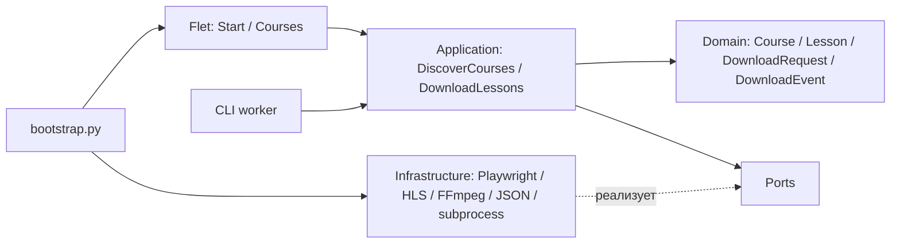

# Архитектура GetCourseVideoDownloader

Статус этой карты: **подтверждено кодом** текущего checkout (02.10.2026). Обнаружение карточек новой разметки проверено локально на сохранённом HTML и тестах в Firefox. Проверки с реальным курсом, авторизацией и собранным EXE здесь не проводились. **Цель владельца:** получить доступные уроки курса и скачать их видео без ручного открытия каждого урока.

`domain/` содержит модели, события и ошибки; `application/` — сценарии и порты. `infrastructure/` реализует браузер, обнаружение страниц, загрузку, хранение, worker и диагностику. `presentation/` содержит Flet и CLI. GUI соединяется в `bootstrap.py`; у CLI worker собственная сборка адаптеров в `presentation/cli/worker.py`. Направление импортов domain/application проверяет `tests/test_architecture.py`.

## Главный поток

1. `main.py` запускает Flet (или `--download-worker` / `--self-test`); GUI-скрипт также объявлен в `pyproject.toml`. `StartScreen` передаёт URL через `StartController` в `DiscoverCourses`, который проверяет схему URL и сохраняет найденные курсы через `JsonCourseRepository`.
2. `GetCourseDiscoverer` открывает постоянный профиль Firefox через `PlaywrightBrowserFactory`. При редиректе на вход он открывает видимый браузер, ждёт подтверждения пользователя и повторно проверяет страницу. Затем обходит ссылки GetCourse stream (не более 500 узлов, до 4 одновременно) и строит дерево `Course`. Модули читаются из `tr.training-row` и карточек `.training-list-wrapper a.card-link`, уроки — из `ul.lesson-list li` и `.LessonList-container a.card-link`; названия карточек берутся из `.training-card__header` / `.lesson-card_heading`. Для нового интерфейса код ждёт скрытия `.gc-redesigned .loader-skeleton` до 15 секунд; таймаут даёт `CONTENT_LOAD_TIMEOUT`, а не пустое дерево. Ссылки нормализуются, чужие домены и дубликаты отбрасываются; при отсутствии распознанных модулей сохраняется запасной поиск stream URL в HTML.
3. `CoursesScreen` показывает дерево, выбор уроков/папок и «Выбрать всё». `selected_course_lessons` создаёт список `SelectedLesson`; после выбора папки и качества `CoursesController` формирует `DownloadRequest`. Загрузка начинается по отдельному действию пользователя.
4. `DownloadLessons` проверяет запрос; `SubprocessDownloadGateway` передаёт его дочернему worker через временный JSON и читает типизированные `DownloadEvent` из JSONL. Команды продолжения авторизации и отмены передаются отдельным JSONL-файлом. Worker создаёт `PlaywrightDownloadGateway`.
5. Worker последовательно открывает **выбранные** страницы уроков в авторизованном контексте Firefox. `PlaywrightDownloadGateway` слушает ответы браузера на HLS и ищет HLS-ссылки во фреймах; затем выбирает вариант качества. `HlsDownloader` отдельной `aiohttp`-сессией получает playlist и сегменты, возобновляет совместимый checkpoint, вызывает `FfmpegMuxer`, атомарно переносит результат в MP4. При отдельной HLS-аудиодорожке она скачивается и объединяется с видео.
6. События обновляют строки уроков, прогресс и итог в Flet. `JsonDownloadCatalog` и уже существующие файлы помогают пропускать готовое; `.gcd-part` хранит сегменты для продолжения. Отмена идёт из UI через worker, проверяется между действиями; закрытие экрана может принудительно завершить процесс после ожидания. Ошибки уроков и запуска пишутся в отчёты диагностики.

## Где искать

| Задача | Файл / модуль |
| --- | --- |
| Точки входа и сборка зависимостей | `main.py`, `src/getcourse_downloader/__main__.py`, `src/getcourse_downloader/bootstrap.py`, `src/getcourse_downloader/presentation/cli/worker.py` |
| Flet: ввод URL, выбор, прогресс, отмена | `presentation/flet/app.py`, `presentation/flet/screens/start/`, `presentation/flet/screens/courses/` внутри `src/getcourse_downloader/` |
| Сценарии, контракты, модели и события | `src/getcourse_downloader/application/`, `src/getcourse_downloader/domain/` |
| Курсы, уроки, вход и браузерный профиль | `src/getcourse_downloader/infrastructure/getcourse/discovery.py`, `authentication.py`, `infrastructure/browser/playwright.py` |
| Перехват медиа на странице урока | `src/getcourse_downloader/infrastructure/getcourse/downloader.py`, `video_signals.py` |
| HLS, checkpoint и FFmpeg | `src/getcourse_downloader/infrastructure/media/hls.py`, `ffmpeg.py` |
| Worker, события и управление процессом | `src/getcourse_downloader/infrastructure/worker/subprocess_gateway.py`, `presentation/cli/worker.py`, `domain/events.py` |
| Настройки, каталог готовых файлов, пути, диагностика | `src/getcourse_downloader/infrastructure/storage/`, `infrastructure/platform/paths.py`, `infrastructure/diagnostics/reports.py` |
| Зависимости, проверки и Windows ZIP | `pyproject.toml`, `uv.lock`, `tests/`, `README.md`, `build.ps1` |

## Границы реализации

- **Подтверждено кодом:** дерево stream/уроков может быть найдено автоматически; после выбора worker сам проходит каждый выбранный урок. Кнопка «Выбрать всё» есть, но запуск не автоматический. Поиск зависит от поддерживаемых URL и HTML-структуры GetCourse; нет доказательства полноты для всех школ, нестандартных страниц или скрытых уроков.
- **Подтверждено кодом:** загрузчик обрабатывает HLS. DASH распознаётся для ошибки `DASH_STREAM_UNSUPPORTED`; отдельного пути для прямого MP4 или самостоятельного аудиофайла в этом `main` нет. Плеер определяется селектором, но общий механизм его принудительного запуска на каждой странице не прослеживается. Отсутствие HLS даёт `PLAYLIST_NOT_OBSERVED` или `VIDEO_NOT_FOUND`.
- **Подтверждено кодом:** браузер использует постоянный профиль, а HLS скачивается отдельной `aiohttp`-сессией с `User-Agent`, `Referer`, `Origin`; явная передача cookies браузера в неё не найдена. Доступные браузеру, но требующие cookies/CDN-условий сегменты могут не загрузиться — это **гипотеза**, требующая проверки на реальном курсе.
- **Требует проверки на реальном курсе:** вход и повторный вход, полнота списка уроков, HLS разных плееров/CDN, итоговые MP4, отмена и продолжение после сбоя. `build.ps1` описывает упаковку Firefox/FFmpeg, worker smoke, ZIP, SHA-256 и SBOM; готовый EXE здесь не запускался.

## Инварианты и проверки

- Domain/application не импортируют Flet, Playwright и infrastructure (`tests/test_architecture.py`). `DownloadRequest` и события — типизированный контракт между GUI и worker (`domain/models.py`, `domain/events.py`, `tests/test_worker_protocol.py`). Текст UI не служит протоколом.
- HLS master playlist задаёт варианты качества, а не уроки. Неполный набор сегментов не является успешным видео; итоговый файл появляется только после успешной обработки (`infrastructure/media/hls.py`, `tests/test_hls_resume.py`).
- Runtime-данные и профиль находятся в пользовательском каталоге `AppPaths`, а не рядом с EXE. Диагностика удаляет query-параметры URL (`infrastructure/platform/paths.py`, `infrastructure/diagnostics/reports.py`). Секреты, содержимое профиля и подписанные URL не переносить в документацию или память.
- Для изменений discovery/auth смотреть `tests/test_parse_courses.py`, `test_discover_courses.py`, `test_discovery_errors.py`, `test_playwright_browser_factory.py`, `test_redesigned_discovery.py`; последние используют отдельный локальный Firefox, безопасные HTML-образцы и блокируют внешние запросы. Для загрузки/worker — `test_downloader_outcomes.py`, `test_hls_resume.py`, `test_worker_lifecycle.py`, `test_worker_protocol.py`; для UI — `test_start_screen.py`, `test_courses_controller.py`, `test_screens.py`. Команды проверок описаны в `README.md`. Результаты локальных тестов не подтверждают живой GetCourse и Windows-сборку.
